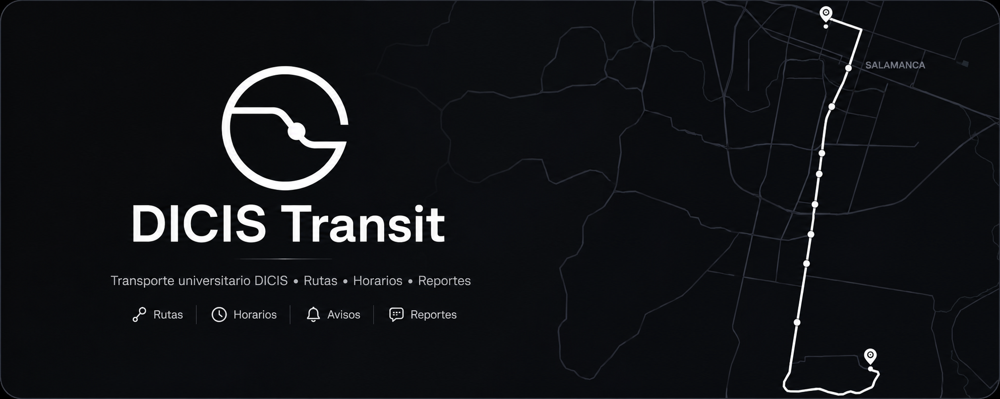

<p align="center">
  
</p>

<h1 align="center">DICIS Transit</h1>

<p align="center">
  Transporte universitario DICIS con rutas, horarios, avisos y reportes colaborativos.
</p>

<p align="center">
  <a href="https://github.com/moraxh/DICIS-Transit"><strong>→ GitHub</strong></a>
</p>

<p align="center">
  
  
  
  
  
</p>

---

DICIS Transit es una propuesta estudiantil para consultar el transporte universitario de la DICIS en Salamanca, Gto. La app muestra rutas, paradas y horarios sobre un mapa interactivo, permite enviar reportes de incidencias y ofrece un panel administrativo para gestionar avisos, reportes y desvíos temporales.

> **Aviso legal:** esta no es una herramienta oficial de la Universidad de Guanajuato. Las rutas, tiempos y ubicaciones son predicciones/simulaciones y pueden contener errores.

## ¿Qué es y qué NO es este proyecto?

El objetivo es sencillo: **ayudar a estudiantes a moverse mejor usando el transporte universitario**.

DICIS Transit se mantiene como una utilidad de consulta, reportes y comunicación rápida. No busca reemplazar sistemas oficiales de la universidad, administrar trámites, ni convertirse en una plataforma académica integral.

## Infraestructura y costos

La arquitectura está pensada para mantener el proyecto **lo más gratuito posible**. Usamos servicios con capas gratuitas y cuidamos especialmente el consumo de recursos:

- **Vercel** para el despliegue de la app Next.js.
- **Supabase** para base de datos, autenticación, RLS y realtime.
- **Firebase Cloud Messaging** para notificaciones push.
- **MapLibre** con token público de mapas para la visualización.

Por eso, cualquier PR que reduzca consultas innecesarias, mejore caché, baje tiempos de build, optimice queries o simplifique trabajo del cliente es muy bienvenido.

## Características

- **Mapa interactivo:** rutas, paradas, sentido y horarios del transporte.
- **Filtros de ruta:** días entre semana/sábado y dirección ida/regreso.
- **Reportes estudiantiles:** retrasos, camión lleno, salidas adelantadas o unidades que no pasaron.
- **Credibilidad de reportes:** puntuación automática basada en historial y corroboración.
- **Avisos y alertas:** comunicados por prioridad, vencimiento y rutas afectadas.
- **Panel administrativo:** KPIs, actividad reciente, salud de rutas, moderación de reportes y avisos.
- **Desvíos temporales:** overrides de rutas sin destruir la ruta base.
- **Favoritos y perfil:** rutas guardadas, badges y preferencias de notificaciones.
- **PWA:** manifest, service worker y experiencia instalable/offline.

## Stack

```txt
app/
  Next.js 16 + React 19
  Tailwind CSS 4
  shadcn/ui + Base UI
  Supabase SSR/client
  TanStack Query
  MapLibre GL
  Firebase Cloud Messaging
  Biome

supabase/
  Migraciones SQL
  Seed local
  RLS, views, triggers y RPCs
```

## Arquitectura

```txt
Estudiante / Admin
        │
        ▼
Next.js App Router
        │
        ├─ Mapa público + sidebar
        ├─ Reportes y favoritos
        ├─ Panel administrativo
        └─ API routes
              │
              ├─ Auth estudiante/admin
              ├─ Transferencia de sesión por QR
              └─ Push notifications
                    │
                    ▼
Supabase Postgres + Realtime
        │
        ├─ routes, stops, schedules
        ├─ reports + credibility
        ├─ notices
        ├─ temporary overrides
        ├─ user favorites / badges
        └─ push subscriptions
```

## Desarrollo local

Requisitos:

- Node.js compatible con Next.js 16
- pnpm
- Supabase CLI

Instala dependencias:

```bash
cd app
pnpm install
```

Levanta Supabase local desde la raíz:

```bash
supabase start
supabase db reset
```

Crea `app/.env.local` con las variables necesarias:

```bash
NEXT_PUBLIC_SUPABASE_URL=
NEXT_PUBLIC_SUPABASE_ANON_KEY=
SUPABASE_SERVICE_ROLE_KEY=

NEXT_PUBLIC_MAPBOX_TOKEN=

REQUIRE_CAMPUS_WIFI=false
CAMPUS_ALLOWED_CIDR=192.168.1.0/24

FIREBASE_PROJECT_ID=
FIREBASE_CLIENT_EMAIL=
FIREBASE_PRIVATE_KEY=

NEXT_PUBLIC_FIREBASE_API_KEY=
NEXT_PUBLIC_FIREBASE_AUTH_DOMAIN=
NEXT_PUBLIC_FIREBASE_PROJECT_ID=
NEXT_PUBLIC_FIREBASE_STORAGE_BUCKET=
NEXT_PUBLIC_FIREBASE_MESSAGING_SENDER_ID=
NEXT_PUBLIC_FIREBASE_APP_ID=
NEXT_PUBLIC_FIREBASE_VAPID_KEY=
```

Ejecuta la app:

```bash
cd app
pnpm dev
```

## Scripts

```bash
pnpm dev      # servidor local de Next.js
pnpm build    # build de producción
pnpm start    # servir build de producción
pnpm lint     # biome check
pnpm format   # biome format --write
```

## Contribuir

Nos encantaría recibir PRs que mejoren la experiencia estudiantil, la confiabilidad de los datos o la eficiencia de la plataforma. Antes de proponer cambios grandes, lee la [Guía de Contribución](CONTRIBUTING.md) para mantener el proyecto alineado y sostenible.

## Contribuidores

¡Gracias a todas las personas que han aportado para mantener este proyecto!

<a href="https://github.com/moraxh/DICIS-Transit/graphs/contributors">
  
</a>
